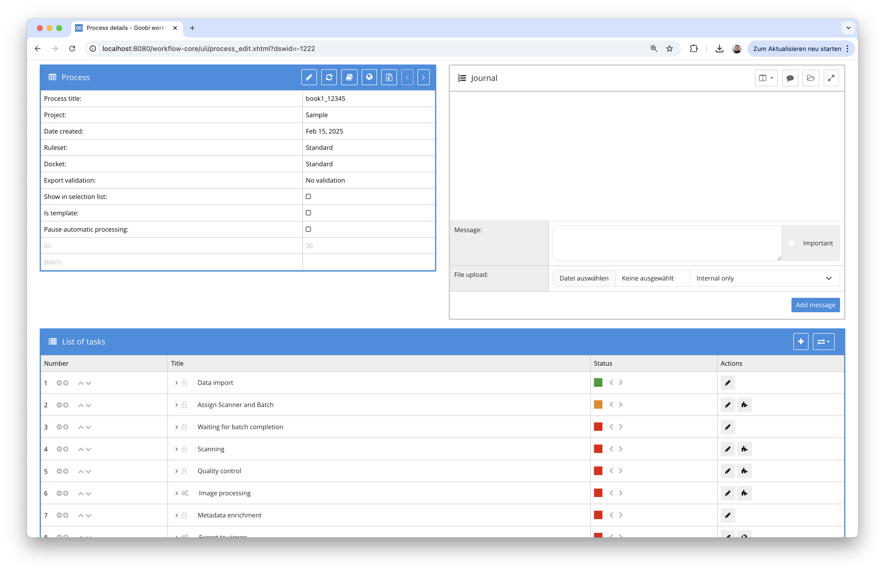
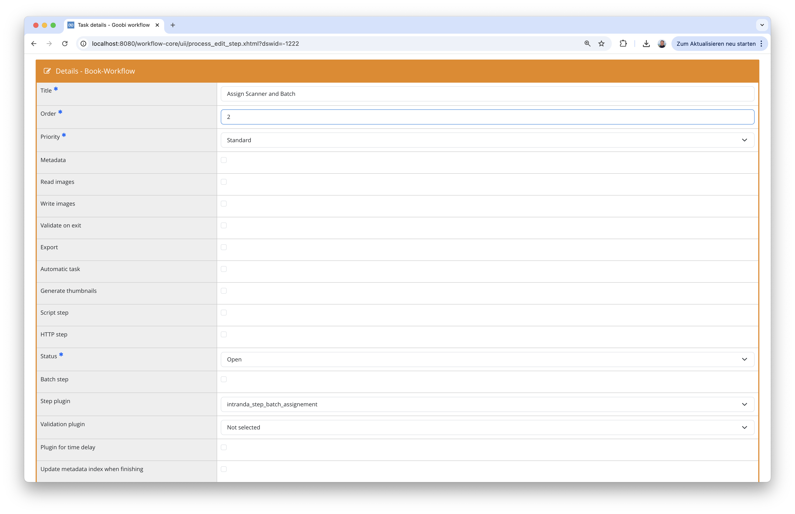
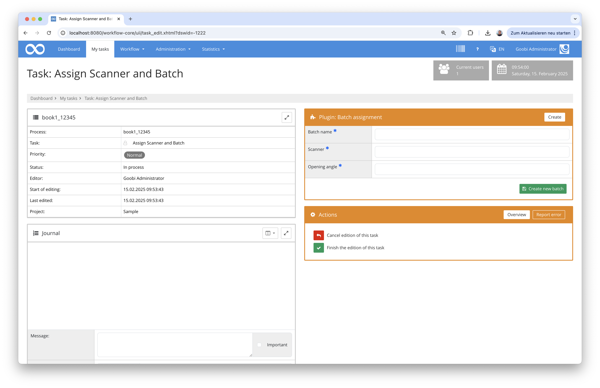
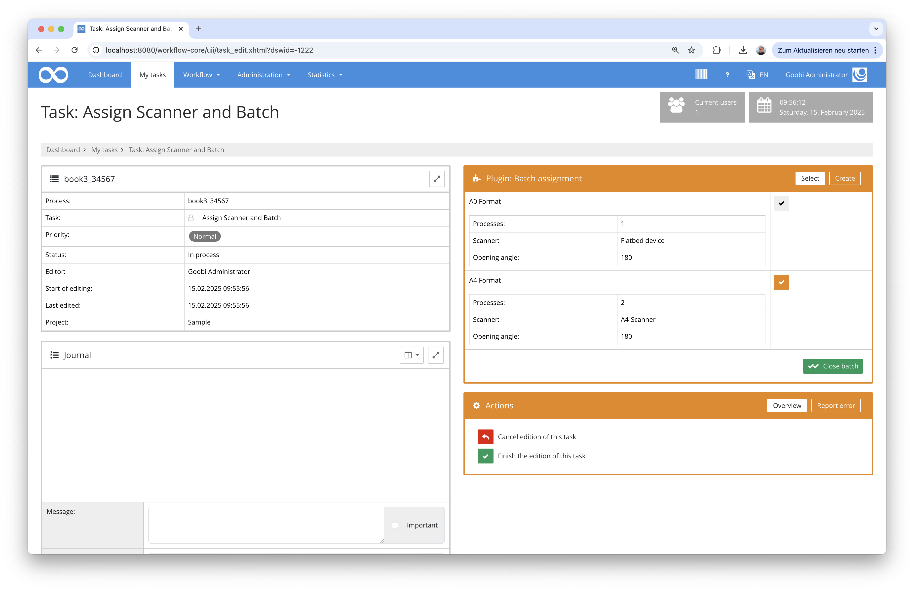
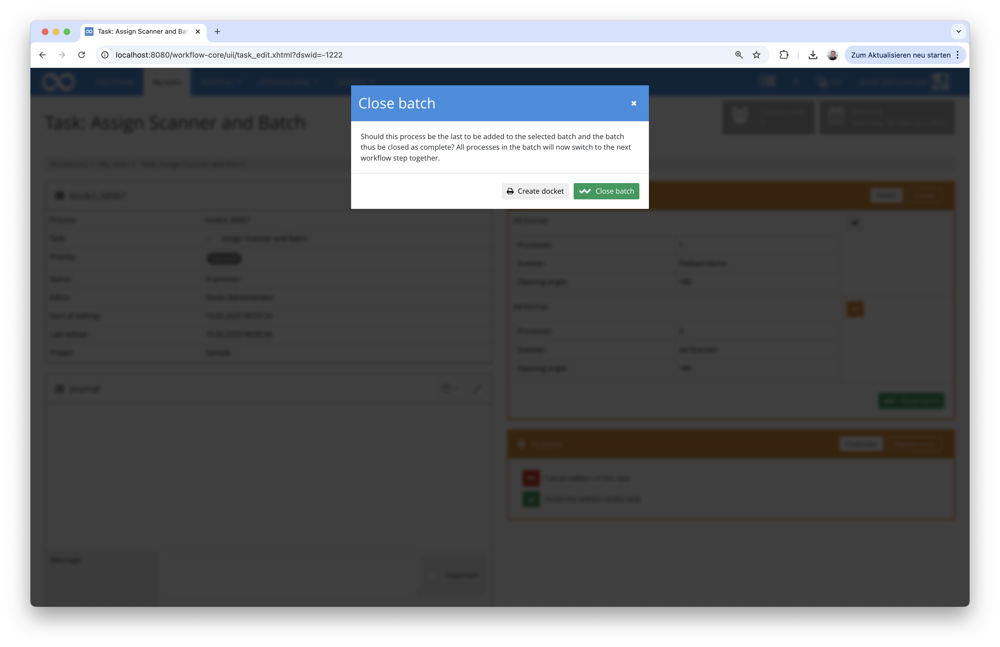
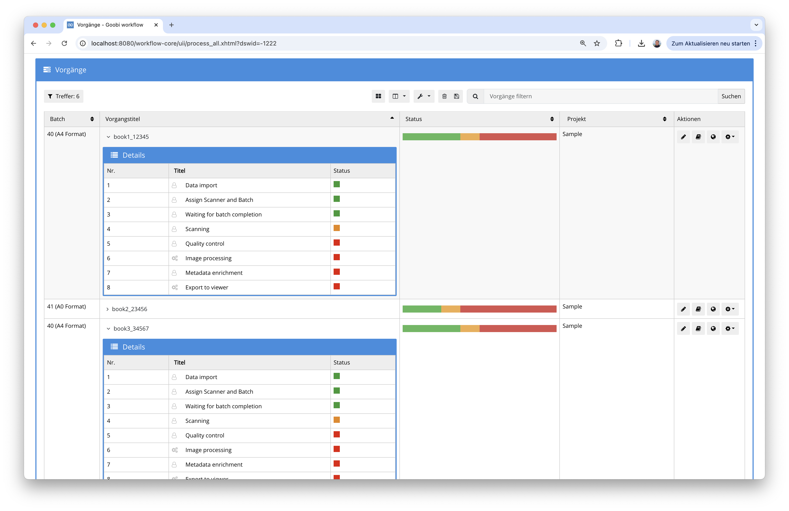

## Introduction
This documentation explains the plugin for assigning a single process to a batch. This assignment is made directly from an accepted task. A new batch can either be created there or selected from a list of existing waiting batches. 

## Installation
To be able to use the plugin, the following files must be installed:

```bash
/opt/digiverso/goobi/plugins/step/plugin-step-ZZZ-base.jar
/opt/digiverso/goobi/plugins/GUI/plugin-step-ZZZ-gui.jar
/opt/digiverso/goobi/config/plugin_intranda_step_ZZZ.xml
```

Once the plugin has been installed, it can be selected within the workflow for the respective workflow steps. Please note that two workflow steps must be scheduled in the workflow:

- One workflow step is used by the user as the step in which the batch assignment takes place. 
- Another workflow step serves as a kind of ‘waiting zone’ in which all processes already assigned to a batch remain and only switch to the subsequent step when the batch is complete. 
 
A workflow could therefore look like the following example:



To use the plugin, it must be selected in the first of the two steps:



## Overview and functionality
Once the user has accepted the task, they can first decide in the plugin whether a new batch should be created or whether a selection should be made from the existing batches that are still waiting. If the user wants to define a new batch, they can define the title for the batch here and, if required, also enter properties that were defined via the configuration:



Alternatively, the user can select a batch from the list of currently waiting batches. Once the desired batch has been selected, the task can be completed as normal.



After assignment to an existing or newly created batch, the workflow for the process moves on to the subsequent workflow step, which can be regarded as a kind of ‘waiting zone’. All processes in a batch initially remain there and do not yet pass through the subsequent steps. 

If the user decides in the workflow step of a process that the batch with this process is now complete, he can click on the button for ‘Close batch’. This opens a dialogue window in which a batch docket can be downloaded and the batch can be closed:



By closing the batch, the workflow step for waiting for all processes in the batch to be complete is finished and the workflow step of the currently open workflow step is also finished. This means that all processes assigned to a batch simultaneously switch to the next subsequent workflow step so that they can be processed further together.



## Configuration
The plugin is configured in the file `plugin_intranda_step_batch_assignment.xml` as shown here:

{{CONFIG_CONTENT}}

{{CONFIG_DESCRIPTION_PROJECT_STEP}}

Parameter               | Explanation
------------------------|------------------------------------
`batchWaitStep`         | Name of the workflow step in which the processes are to remain until the last process is added to the batch
`property`              | Names of those properties of the process that are to be editable when the batch is created and that are to be adopted for all associated processes
